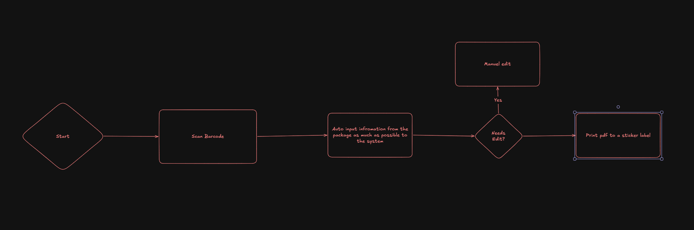

# Parcel Package App
## Overall
This is a product for jobs that handles goods and packages. The idea of this product is to make things easier for people who deliveres packages, registers to the system. most of the package apps is very manuel work, and slow. With this product, we want to automate and help with making delivery easier to work with. Of course there is also manuel deliveries, if things is going wrong. This product is focusing on **Simplification** and **Automation**. What i mean with Automation is by scanning a package, it should add the inputs automatically from the packages. 

### Features that should include in this project
#### First MVP
- Login (Role-based)
    - Role Available:
        - Chief
            - Dynamic RBAC (local)
            - Register, Update and Delete packages
        - Employee
            - Register, Update and Delete packages
        - Intern
            - Register, Update packages    
        
- Register Packages (Single Package)
    - Information needed to register:
        - Tracking number
        - Carry (who drove the packages)
        - Type (is it cold, parcel, frozen, multiple tempratures, REK letter, Pallet, EXT)
        - From (who has sent this package)
        - To (who the package is to)
            - Institue
            - Route (ABC, DEF, MBW, Arrenhius, Biblotek)
            - SU Number
            - Email (This sends a notification if its checked)
            - Room number on the person the package should be delieverd to, if it exists
        - Extra: if there needs extra infromation, needs to have some limit of text, so that it does not override with other informations. 
        
        This information should be saved, then create a pdf, that is going to print on sticker, with tracking number that cna be scanned, Who its from, and who this package it to, what type of package it is, extra information, and room number.
        The information on the sticker should be organized, and it should not override each other. 
    - Prints only 1 single label
- Multi Register Packages
    - Uses same information as single, but different type of way to print labels, either can:
        - paper with the list of multiple packages
        - multiple labels
        - 1 label that shows how many packages are registered to teh tracking number.
- Domain Model of package:
Package
    - id
    - tracking_number
    - carrier
    - package_type
    - sender
    - recipient
    - institute
    - route
    - su_number
    - email
    - room_number
    - extra_information
    - status
    - created_at
    - updated_at
    - created_by
- Search for Packages
    - It should be fast
    - either needs
        - name of person that the package is being delieverd to or has been delivered to
        - name of the company that has sent the package (from, not who drove the package)
        - tracking number
        - filter with dates.
- Delete Packages

Testing the result should be done through local web, we are aiming for the simplifiying the looks and workflow/pipeline.

### Tech Stack
- **Frontend**: Typescript
- **Backend**: Python
- **API**: FastAPI
- **Database**: local (for the MVP)

### AI Agent Rules
- **Plan Mode**: for planning for tasks for each role
- **Documentaton**: Writes about features added, when implementing a feature.
- **Writing Code**: Should be reusable, scalable, and modular. To explain complex or large code, for function/methods, use multistring to explain what the method/function does, for small code like loops and if statements, use comments.
- **Allowed**: 
    - Agents are allowed to make researches through web when it comes to writing systems, designing architectures, to further understand things better.
    - Agents are allowed to add Agents skills 
    - When there is something that is repeated multiple times while working, agents are allowed to find skills for it, or design custom skills if there is no skills found for the repeation actions.
    - Create agents or subegents if the agents makes sense for the project, an example, if it local, there is not need to create an agent that helps with the production.
    - Agentic team to work in paralell
- **Not Allowed**: 
    - make changes to the structure, without checking with me
    - working on a unrelated thing if its not a task
    - create a PR without writing tests and making sure the tests has passed.
#### Token Efficency
- AI Agents should optimize to use token efficently.
- extra words that has no meaning, is not necessary. As long as the messsage is understandable enough. for example, long words to sound professional, is not needed. talking like caveman could be enough, as long as agents understand each other on what to do.
But when it comes to report or summarize to me (human) of course i need to understand, which you can then talk normally.
## Model usage
### Claude Models
- **Haiku**: fast and light. Quick lookups, reformatting text, simple "what does this error mean," short translations, flashcard generation. If you'd be annoyed waiting more than a few seconds, it's Haiku territory
- **Sonnet**: your everyday default. Most coding help, explaining concepts, debugging a single file, writing and editing, studying for your bygg courses. It handles the vast majority of what you do well.
- **Opus**: use it when the problem is tangled. Examples are architecture questions ("how should these Azure services fit together and why"), reading an unfamiliar codebase and building the big picture, multi-step agentic work like building a portfolio project end to end, or anything where Sonnet's answer felt shallow.
- **Fable**: the top tier, above Opus. Save it for the hardest stuff, such as long, complex projects, deep reasoning, or cases where Opus gets stuck.
### GPT/Codex Models
- **Luna** → fastest. Use for quick coding questions, syntax help, small bug fixes, simple explanations, and lightweight brainstorming.
- **Sol** → best default for serious project work. Use for architecture, debugging harder issues, reviewing code, designing systems, multi-step reasoning, and technical decisions.
- **Astra** → use when you want deeper reasoning than a fast model but don’t necessarily need the heaviest option. Good for tougher debugging, code analysis, and more complex planning.
- **Codex** → use when the main task is actually editing/working through a codebase, especially across multiple files, tests, refactors, or repo-level tasks.

## Worst case scenarios/error handling
### If packages has no tracking number
- create a trakcing number

### if there is no name for the person to deliver to: 
- can use the institiute place

## Workflow:
#### Register packages

1. Scan barcode
2. System: auto inputs as much information the system cna find of hte package to the register labels with use of Parcelsapp.com.
3.  Needs more edit? (if something inputted wrong, or there is label input missing)
    - yes: manuel edit
    -  no: create a pdf and print 